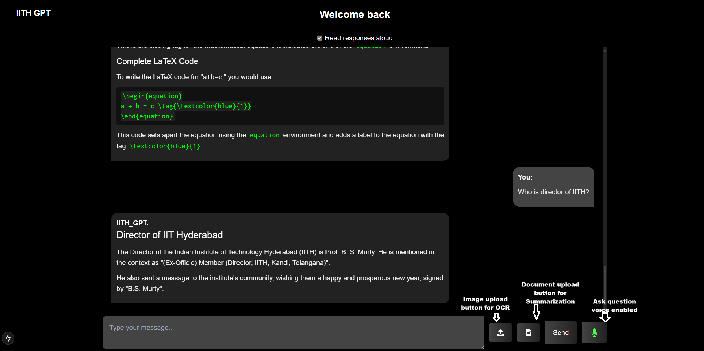

# IITH GPT

## Overview
IITH GPT is a project developed for the IITH community to learn more about IITH and engage with its resources interactively.

## Screenshot


## Video Demonstration
<video width="640" height="360" controls>
  <source src="assets/IITH_GPT%20demo.mp4" type="video/mp4">
  Your browser does not support the video tag.
</video>

## Usage

### 1. Clone the Repository
```bash
git clone <repository-url>
```

### 2. Update File Paths & API Keys
- **File Paths:**  
  In `IITH_GPT/with_UI_and_memory/IITH_GPT/Agentic_code/RAG_LLM.py`, update the values for `index_path` and `metadata_path` as needed.
  
- **API Keys:**  
  Provide your own API keys in the required sections of `RAG_LLM.py` (for HF key and Tavily key) and `utils.py` (for Gemini key).

- **MongoDB URI:**  
  In `backend/server.py`, update the MongoDB URI accordingly.

<div style="border: 1px solid #ccc; padding: 10px; border-radius: 5px;">
Make sure to have Ollama set up locally.

**Download Ollama Installer**
- Visit [Ollama's website](https://ollama.ai) and download the Windows installer (e.g., `Ollama_setup.exe`).

**Install Ollama**
- Run the downloaded installer.
- Follow the on-screen instructions to complete the installation.

**Install the `llama3.1` Model**
- Launch the Ollama application.
- Search for the `llama3.1` model in the model marketplace.
- Click to install or download the model.
</div>

### 3. Setup the Environment

#### Python Environment
1. Navigate to the project directory:
   ```bash
   cd IITH_GPT/with_UI_and_memory
   ```
2. Create a virtual environment:
   ```bash
   python -m venv venv
   ```
3. Activate the virtual environment:
   - **Windows:**
     ```bash
     venv\Scripts\activate
     ```
   - **Unix/Mac:**
     ```bash
     source venv/bin/activate
     ```
4. Install Python dependencies:
   ```bash
   pip install -r requirements.txt
   ```
5. Install the package (from inside the `IITH_GPT` folder):
   ```bash
   cd IITH_GPT
   pip install .
   ```

#### Frontend Setup
1. Return to the `with_UI_and_memory` directory:
   ```bash
   cd ..
   ```
2. Install npm dependencies and start the development server:
   ```bash
   npm install
   npm run dev
   ```

### 4. Run the Backend Server
1. Open a new terminal and navigate to the `backend` directory:
   ```bash
   cd backend
   ```
2. Start the server:
   ```bash
   python server.py
   ```

### 5. Access the Application
Open your web browser and navigate to `http://localhost:3000` (or the specified port) to start using the site.
